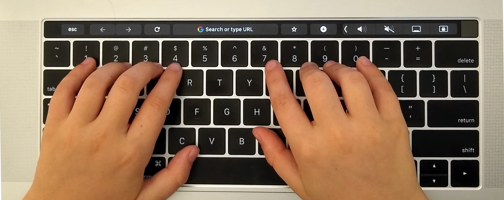

# Typing Practice

My daughter needed a way to practice typing just the numbers (0-9) on the keyboard for the [ReflexMath](https://www.reflexmath.com) games her 2nd grade teacher encouraged her to play. There are a lot of crap typing websites out there. This takes it down to just the basics (no ads, no distractions, no tracking). 

This practice assumes that the goal is to use the number row on the keyboard, not a numerical keypad.



## Getting started

To practice typing, visit [https://canadaduane.github.io/number-typing](https://canadaduane.github.io/number-typing)

We hope you enjoy it!


## Installation

This is a react app, so you should be able to do the following (assuming `node` and `yarn` are installed):

```
yarn install
yarn start
```
